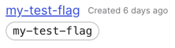

# Launch Darkly CLI
The un-official command line tool for Launch Darkly. |
 **v0.0.1**
---

### ONLY SUPPORTS MACOS AT THIS TIME
In the future, this tool will be supported to more operating
systems, but for now you can only use this tool on a Mac,
apologies.

*Want to make this project available for more people?
Contribute!*

---

### Table of Contents

- [What is this repository?](#what-is-this-repository)
- [The Why](#the-why)
- [Getting Started](#getting-started)
- [Currently Supported Commands](#currently-supported-commands)
- [Contributions](#contributions)

### What is this repository?
This repository contains the side project I worked on 
during my internship at [Arrive Logistics](http://arrivelogistics.com/).
It is a tool created in Bash that contains
only a few functionality that the original LaunchDarkly UI has such as toggling
feature flags and getting their statuses, but will contain more features
in the future.

### The Why
I decided to get started on this project for my interest
in developing my first ever command line tool. Even 
though there were many ideas I could work on, I wanted
to start with something simple as well as create
a tool that the engineers at Arrive could potentially
use. I decided to create a tool for LaunchDarkly because
I thought there was a problem I could solve for them.
Instead of taking the time to open your browser and 
get into the Launch Darkly UI, you can save yourself
time and clicks by just opening your terminal and
running your commands. While I am aware of existing programs
to LaunchDarkly like the [CLI tool from LaunchDarklyLabs](https://github.com/launchdarkly-labs/ldc)
and the [Visual Studio Code extension](https://marketplace.visualstudio.com/items?itemName=LaunchDarklyOfficial.launchdarkly)
by the official LaunchDarkly team, I believe this tool
can be beneficial to users that use IDEs other than Visual Studio
Code and could be used in GitHub Workflows.


### Getting Started
1. If you haven't already, begin by cloning the
repository in your preferred directory.
```shell
git clone https://github.com/MarkE16/LaunchDarklyCLI.git
```
2. Next up, take a peek inside the folder of the project.
The config.json file will 
contain the necessary configuration settings for 
the script to run properly.
```json
{
  "configurations": {
    "accessToken": "YOUR_ACCESS_TOKEN",
    "defaultEnvKey": "test"
  }
}
```
- **accessToken** - A token will be needed in order
to access the Launch Darkly API. If none is provided,
you will get `401 Unauthorized` errors when attempting
to run commands. To get a token, log into the Launch
Darkly UI and go into *Account Settings > Authorization >
Access Tokens*. Generate a token with **admin** permissions
then place the token in the *accessToken* field.
> #### Important!
> It is usually not a good idea to give tokens full
> permissions. If stolen, anyone can modify and wreck
> your project. However, at this time, you are **required**
> to give this token admin permission for this tool to operate.
> In the future, `config.json` will be modified to accept
> a **read** and **write** access token, that way
> the token with **read** permissions will perform read
> operations while the token with **write** permissions
> will perform write operations.
- **defaultEnvKey** - The key of any environment in your
project. The key will be used in API requests to get or
modify any feature flags in this environment if you do
not pass in an additional environment key to the `-e`
environment flag.
- **defaultProjectKey** (*NOT REQUIRED AT THIS TIME*) - 
The key of any project you have created. This serves 
the same purpose as the **defaultEnvKey** field 
except that it targets different projects and not
environments. If you want to get or modify a 
feature flag but don't pass a project key in 
the `-p` flag then the default will be used.

> ### Psst!
> In case you don't know where to find the keys,
> you can find them under the key/environment/project name.
> The keys are usually the same, but it can't hurt to
> check.
> 

3. Once you have your configuration ready, you can run
the program, but first you will need to add the program
to your PATH if you want to run this program *anywhere*
from the terminal.
   - For **zsh** owners: Find your `.zshrc` file from your
home directory and then add this line to the file:
```shell
export PATH="$PATH_TO_LD_FILE:$PATH"
# For example, if the program was located in ~/code/LDCLI,
# ("~/" references the home directory.)
export PATH="Users/you/code/LDCLI:$PATH"
```
4. Cool, everything should be all set for you to
use the **Launch Darkly CLI tool**!

### Currently Supported Commands
Currently, there is not many commands In the future,
this list will be more populated with commands that
contain features that the Launch Darkly UI has, so
be on the lookout for updates. Otherwise, the
command line tool currently supports:
- `toggle (flag_key) [true/false] [-e] [-s]` - Turns
a feature flag on or off.
  - Required Parameters
  - `flag_key` - The key of the feature flag to toggle.
  -  Optional Parameters
  - `true/false` - The value to toggle the feature flag to.
If a value is not passed, the flag will be toggled
to the opposite of its current value.
  - Flags
  - `-e` (Environment) - The environment the feature flag
should be toggled in. If not used, the default environment
will be used from `config.json`.
  - `-s` (Silent) - Toggles the output message. If passed,
the new value of the feature flag will be outputted, otherwise,
a success message will be shown (This will not hide error messages).
- `status (flag_key) [-e] [-s]` - Gets the current on/off
status of the given feature flag.
  - Required Parameters
  - `flag_key` - The key of the feature flag to fetch.
  - Flags
  - `-e` (Environment) - The environment the 
feature flag that should be fetched. If not used,
the default environment will be used from 
`config.json`.
  - `-s` (Silent) - Toggles the output message. 
If passed, the current value of the feature flag 
will be outputted, otherwise, a success message 
will be shown (This will not hide error messages).

Currently, you cannot do much in the command line,
but in the future you will (hopefully) be able
to create flags, environments, projects, modify
feature flag values when on/off, and much more!

### Contributions
Yes! This repository does accept contributions. As
this project is only maintained by a college freshman,
there is a lot that I can miss and I likely
will not have tons of time on my hands to update this
often. However, it does not just have to be myself
that has to work on it, it can be you as well! Here's
how:
- **Pull Requests** - Quite literally the most simple
way to contribute. If you want to add your own feature,
fix a bug, or make improvements to the code, you can do
so by cloning the project, creating a branch, create and
commit your changes, then make a PR for it. If it looks
good, then it will be merged.
- **Become a Collaborator** - If you'd like to partner
with me and would like to regularly work on the project on
your own time, please feel free to reach out to me, and we
can work out the details. You can find a few of my contact information
on my GitHub profile, but you can also visit my website as well.
(Also, you will not get paid, sorry.)